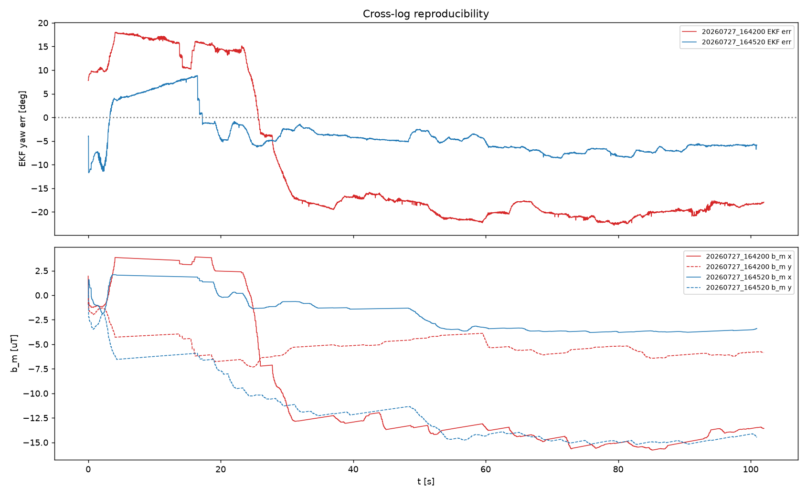
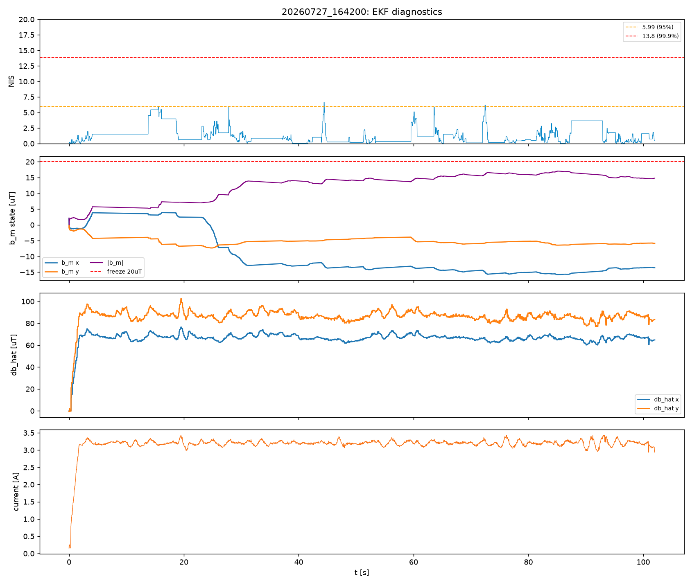
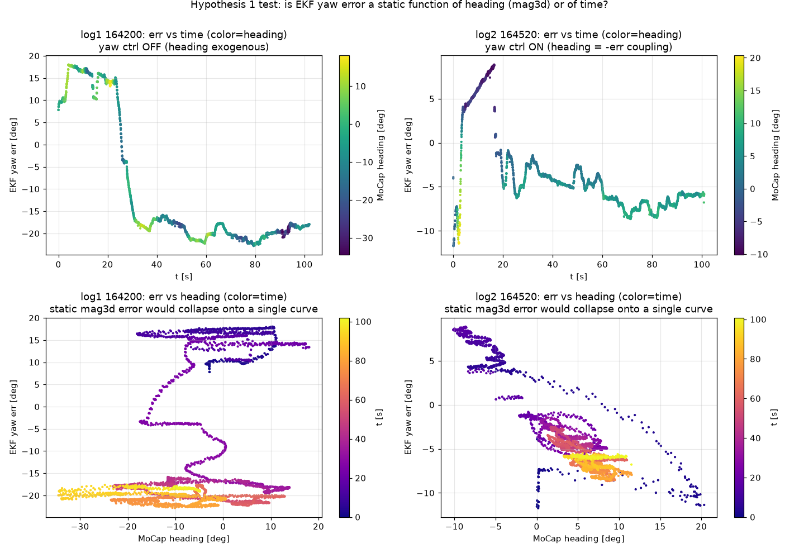
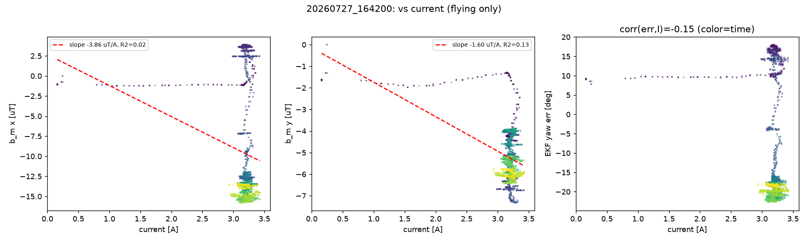
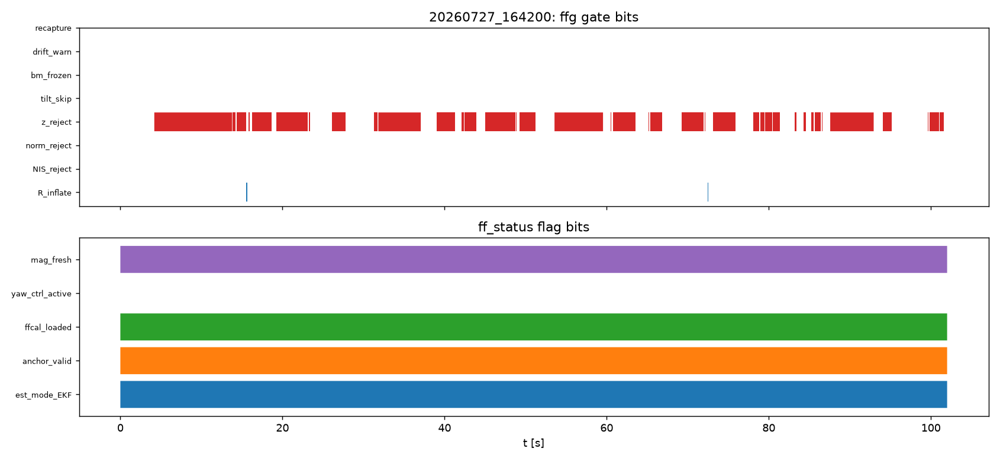
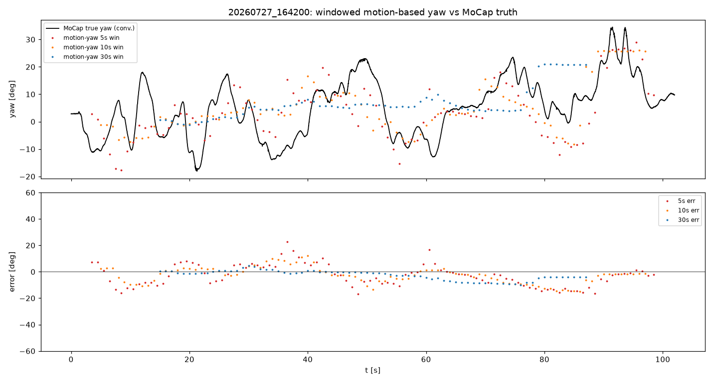
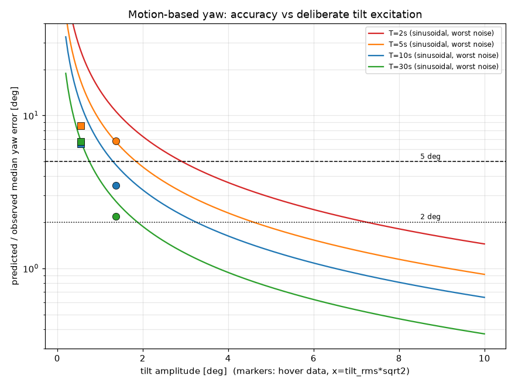

# 飛行ログ解析(2026-07-27): EKFヨー推定のMoCap乖離診断と改善構想の評価

対象ログ(いずれも v5=109列超、位置制御・定点ホバ、MoCapヨー真値あり):

| | ログ1 | ログ2 |
|---|---|---|
| ファイル | `logs/flight_logs/20260727_164200_position.csv` | `logs/flight_logs/20260727_164520_position.csv` |
| 内容 | ホバリング(目標 0,0,0.3m)102秒、**ヨー角制御OFF** | 同左 100.9秒、**ヨー角制御ON** |
| 電圧 | 4.24→3.37V | 4.26→3.45V |
| 飛行中電流 | median 3.20A | median 3.22A |

解析方法: マルチエージェント解析(コード読解4系統+観点別診断3系統+敵対的検証3系統+
構想評価2系統+横断整合チェック1系統)。全定量主張は独立再計算で照合済み。
図・スクリプト・統計JSONは `docs/analysis_20260727/` に格納。

MoCap真値: `mocap_yaw_true_deg`(= −(mocap_heading_deg − 88.6)、flip補正済み)。
flip補正行の統計汚染 <0.03°、テレメトリ遅延90msの影響 RMS≤0.07° — **真値として信頼可**
(7/17時点の「mocapヨーは真値に使えない」はマーカー非対称化+v5 flip補正で解消)。

---

## 0. 結論サマリ

**課題**: EKFヨー推定(`tlm_yaw_est_rad`)のMoCap乖離が、ジャイロ積分・Madgwickより大きい。

**3観点の影響度ランキング**:

| 観点 | 影響度 | 位置づけ |
|---|---|---|
| ② 電流FF補正の残差 | **高** | 誤差の**発生源**(飛行中の水平準定常バイアス13〜16µT) |
| ③ EKFのb_m状態設計 | **高**(実質同格) | 残差をヨー誤差へ**変換した機構**(被害の大きさを決めた) |
| ① 3Dキャリブレーション劣化 | **低** | アンカーが静的誤差を吸収する構造のため主犯になれない |

3観点は排他的ではなく「発生源(②)×変換機構(③)」の**直列構造**。
「磁気センサーの精度悪化」という当初仮説は、正確には
**「電流FF補正残差という準定常磁気観測バイアス + それを吸収できないEKF設計
(ホバ中のψ/b_m縮退 + τ_bm=120sゼロ回帰ポンプ)」** に修正される。

**構想評価**: 移動ベースヨー推定は実現可能性**高**(実データPoCで実証、§6)。
飛行中自動磁気チューニングは実現可能性・有効性とも**高**(ArduPilot COMPASS_LEARN=3 /
PX4 EKF2磁気バイアス状態 / MagFit と同型の実運用実績あり、§7)。

---

## 1. 実測: 3系統ヨー誤差(vs mocap_yaw_true_deg)

| 系統 | log1 RMS / max\|・\| / ドリフト | log2 RMS / max\|・\| / ドリフト |
|---|---|---|
| **EKF** | **17.97° / 22.8° / −23.9°/min** | **5.80° / 11.7° / −5.9°/min** |
| ジャイロ積分 | 4.19° / 7.4° / +1.55°/min | 0.42° / 2.3° / −0.10°/min |
| Madgwick(6軸) | 3.85° / 7.2° / +0.96°/min | 0.69° / 2.8° / −0.54°/min |

- ジャイロ・姿勢系は100秒で1°台しか誤差を溜めない。**劣化は磁気観測経路に限定**。
- EKF誤差は一定ドリフトではなく**階段状**(log1: t≈25-30sで+18°→−18°へ遷移)。
  遷移は磁気更新が受理される窓(z_reject解除)でのみ発生。
- EKF誤差はb_m状態と**ほぼ完全に連動**(log1 重回帰R²=0.987、感度≈2°/µT、
  暗黙|B0h|=27.9µT — 水平地磁気30.9µTと物理整合)。

## 2. 確定したメカニズム(因果連鎖)

1. **アンカーは地上・アイドル電流(0.15A)で取得**(`sensor_hub_ff.cpp` のB0凍結)。
   観測 h = R_z(ψ−ψ0)·B0h + b_m は「アンカー時との差分」を見る。
2. 離陸で電流 0.15→3.2A。FF補正 **|ΔB̂|≈110µT(水平地磁気の3.7倍)** が入り、
   その残差として**水平13〜16µTの準定常バイアス**が発生
   (独立再構成で両ログ同規模。log2では方向≈−108°一定のまま t≈50s で飽和 =
   離陸・電流ONの準定常ステップであり、連続的な時変残差ではない)。
3. 一定ヘディングでは δy = (∂h/∂ψ)δψ + δb_m の縮退で **ψとb_mの分離は不可観測**。
   分離は事前分布のみで決まるが、b_mはτ=120s GMで**定常σ≈1.1µTしか保持できない設計**。
   実残差はその**14倍**。
4. **τ_bm=120sのゼロ回帰が毎秒≈0.12µTをb_mから漏らし、磁気更新のたびにψへ転嫁する
   ポンプ**として働く。コード実定数のKF再生シム(実ログの受理マスク使用)がlog1の
   最終ψ誤差−28.6°(実測−27.9°)と|b_m|17.8µT(実測16.0µT)を再現 — 機構は定量的に確定。
5. **NISは無反応**(mean 1.25、>13.8棄却 0%)。σ_ff=0.03·|ΔB̂|≈3.3µTの自己申告が
   R_effを4→≈16µT²へ膨張させ、15µT級バイアスでもNIS<13.8に収まる。
   **EKFの自己診断は今回の故障モードを構造的に検出できない**。

**log1とlog2で被害が3倍違う理由**: 残差量はほぼ同じ(13〜16µT)なのに、
不可観測方向への配分が log1=+14.2µT(ヨー約29°相当)/log2=+0.004µT と走行毎に変わる
「誤差の押し付け合い」。**残差が残る限り、被害の大きさはほぼ運で決まる** —
7/17(σ2.7°で良好に見えた)と7/27の差もこれで説明される。

## 3. 観点別診断

### 3.1 ① 3Dキャリブレーション — 低

- ヨー制御OFF(ヘディング外生)のlog1で、誤差はヘディングの関数(R²=0.10)ではなく
  時間の関数(R²=0.64)。最大遷移(−23.6°/5s)窓内の d(err)/d(heading)=0.05deg/deg。
- 観測誤差を静的キャリブ誤差で説明するには**|Δb|≈38µTが必要**だが、実プロファイル比較
  (6/12→7/10)の実測ハードアイアンドリフトは**1.58µT/28日 = 必要量の1/24**。
  ソフトアイアン対角変化(−2.9〜+2.3%)の寄与上限≈1.5°。
- 2ログ間で同一ヘディングの誤差マップが再現しない(相関−0.03)。
- 2〜3週間使い回しの直接寄与は数度未満が上限。ただしlog2の全RMSが5.8°なので
  相対的に非無視 — 再較正するなら**当日にmag3d+FFペアで**
  (mag3d単独更新は `sensorHubFfOnMag3dChange()` の ff_mode=0 降格により仕様上不可)。

### 3.2 ② 電流FF補正 — 高(発生源)

- ログのΔB̂再構成照合(RMS 0.6〜1.1µT一致)により
  **使用プロファイル = DroneX_20260713(14日前)と確定**。
- 水平残差13〜16µTは補正量の12〜14%、自己申告σ_ff(3.3µT)の5倍。
  残差は**機体固定方向・電流ON時限定**(headingバンド検定: heading差24.2°に対し
  b_m方向差1.1° — 世界固定の環境変化説を棄却)= モーター電流磁場のモデル不適合が起源。
- duty→電流多項式の陳腐化を直接検出: s=I_active/ΣÎ_m=0.81〜0.83(較正日≈1.0)。
  ただし方式B差動項の寄与は2.5〜3.7µTで実害は限定的。
- **注意1**: z_reject(60〜63%発火)は**FF劣化の直接証拠ではない**。z残差は高度と
  強い用量反応(高度ビン0.09→0.44mで発火率23→95%)を示し、主変調は
  「地上アンカーB0.zとホバ高度0.3mの環境鉛直磁場差」。
  **再較正のA/B判定にz_reject率を使わないこと**(環境要因なので下がらない)。
  判定は |b_m|最終値(目標<5µT)とヨー誤差RMSで行う。
- **注意2**: 較正4日後の7/17でも|b_m|は18.6µT/90sと同規模だった。
  ベンチ静止と飛行の条件差・電圧/duty依存項の欠落・モーター磁化ヒステリシス
  (プロファイル実測5.7〜8.2µT)という**構造的FF誤差が土台にあり、陳腐化はその上乗せ**。
  再較正だけでは同型事故は根絶できない。

### 3.3 ③ EKFのb_m状態設計 — 高(変換機構)

§2の(3)〜(5)が本体。追加の定量事実:

- アンカー時の P←P0 完全リセット直後は K_ψ=0.87°/µT/更新(半減0.2s)で、
  最初に受理したバイアス磁気に必ずスナップする(P0でS≈56µT²に膨れNIS棄却も不能)。
- 定常時の磁気引き込み時定数 ≈15〜16s(10Hz受理)/ z_reject 60%下で ≈38〜41s。
  ジャイロドリフト(≤1.6°/min)より磁気を支配的に信じる配分。
- b_m最終値: log1 (−15.1,−5.9)µT、log2 (−3.7,−14.9)µT — ノルムは両ログ一致(15〜16µT、
  凍結閾値20µTの8割)だが方向は不一致 = 「真のバイアス」ではなく誤差の押し付け合い。

## 4. 移動ベースヨー推定 PoC — 実現可能性: 高(条件付き)

MoCap位置のSG平滑2階微分+Madgwickロール/ピッチから窓内最小二乗でヨーを逆算
(真値は座標規約と遅延の一回較正のみに使用):

- モデル整合: MoCap加速度は傾きモデルでコヒーレンス0.94/0.84で再現。
  テレメトリ遅延+80〜100ms。実測σ_a=0.039〜0.059 m/s²。
- **意図的移動ゼロの定点ホバ(傾きstd 0.4〜0.9°)でも**: 30s窓で中央誤差2.2°(log1)/
  6.7°(log2)、**RMS 4.5° — 壊れた磁気EKF(18°)より既に良い**。
- 誤差は励振量の1/√(Σ|u|²)スケーリング(CRLB)に従う。必要機動量の逆算:
  **±5°精度 → 傾き1.9°・位置振幅±3.2cm・5秒**。±2°には系統フロア(±3〜8°:
  遅延残差・世界系トリム・レバーアーム起因)の対策が前提。
- ジャイロコースト(実測≤1.6°/min)と組み合わせれば**2〜5分毎の小機動で±5°を連続維持可能**。
- 設計指針: **機動は直線往復か8の字**。円運動は遅延τがヨーバイアスωτになる縮退あり
  (0.5Hz円+未較正80msで14°)。
- 先行実績: PX4/ArduPilot **EKF-GSF**(GPS速度+比力で磁気レス飛行)と同原理。
  本方式は「GPS速度→MoCap位置」「加速度計→姿勢傾き」置換版でノイズ的に有利。

## 5. 飛行中自動磁気チューニング — 実現可能性: 高 / 有効性: 高

設計上の要点(詳細な比較検討は解析セッション記録):

1. **「ヨー角差のスカラー比較」で実装しないこと**。1ヘディングではΔbの1自由度しか
   決まらない。正しくは**レベル化磁気ベクトル(2成分)をEKFに残したまま、
   ヨー擬似観測 z_ψ = ψ_ref(H=[1,0,0,0])を追加**する。磁気2式+ヨー1式で
   **一定ヘディングのホバ中でもb_mの2自由度が完全可観測**になる。状態拡張不要。
2. **τ_bmの適応化が必須**: ヨー観測health時はランダムウォーク化(ゼロ回帰停止)、
   喪失時は**b_m凍結保持**。ゼロ回帰のままでは正しく推定したb_mをψへ再注入し続ける。
3. ハードアイアンの恒久較正には**ヨー回転励振**(±90°〜緩い360°回頭)が必要。
   磁気EMA遅れ(τ≈0.46s)のため回頭中サンプルは除外か遅れ補償。実施はホバ安定後。
4. セーフガード: シャドーモード → イノベーションゲート(|δψ|>30°棄却)→
   N連続整合で融合開始 → レート制限(既存ソフト再捕捉のΔψ3°/更新パターン流用)。
5. **NVSコミットの罠**: 学習Δbをmag3dに書き戻すと ff_mode=0 強制降格+PC側
   バインディング照合拒否。**mag3d非破壊の新規NVS項目(例: magbias)として加算適用**、
   飛行中書き込み禁止・着陸後コミット。
6. **開発短縮の発見**: `mocap_yaw` は既にCMD_POS_ERRで50Hz機上着・未消費
   (`flight_control.cpp:517-521`、`flight_state.hpp:108` に診断用と明記)。
   `updateYawObs(psi_ref, R)` を一度作れば、基準ソースをMoCapヨー(ラボ検証)→
   移動ベースヨー(汎用運用)に差し替えるだけで同じ較正機構が動く。
7. 副次効果: b_mが可観測になると、**b_m時系列が(電圧, duty, 電流)への回帰データになり、
   FFモデルの電圧/duty依存項を実飛行から学習できる**(7/17解析§2.8.2の中期課題への入力)。

先行事例: ArduPilot COMPASS_LEARN=3(飛行中コンパス学習)/ COMPASS_MOT / MagFit、
PX4 EKF2(機体座標磁気バイアス3状態、機動中に可観測・飛行間永続化)。
構図自体は実運用で確立済み — 新規性は「MoCap級精度の基準による較正」と
「電流FF残差のオンライン学習」。

## 6. 推奨アクション(優先順)

1. **ログ列の追加(全ての前提)**: 生磁場b_cal(またはFF補正後レベル化観測z)。
   現状はリプレイもバッチ較正も不能(`YAW_FUSION_EKF_DESIGN.md` §9に既存計画)。
2. **飛行状態アンカー**: ホバ安定後(離陸+5s程度)にB0を飛行電流状態で再取得する
   自動再アンカー。**残差の大部分を発生源で消せる最小改修**。
3. **τ_bm適応 + ヨー擬似観測(a′案)**: シャドー→段階有効化の二層導入。
4. mag3d+FFの**当日ペア再較正**(底上げ。判定は|b_m|最終値とヨーRMS)。
5. 移動ベースヨーはPC側モニタ実装から(PoCスクリプトが叩き台)。

## 7. 成果物

- 図: `docs/analysis_20260727/*.png`(誤差時系列・EKF診断・電流相関・NIS・ゲート・
  ヘディング分析・PoC・必要機動量)
- スクリプト・統計: `docs/analysis_20260727/scripts/`
  (`yaw_error_analysis.py` 誤差定量化、`poc_yaw_from_motion.py` 移動ベースヨーPoC、
  `required_motion.py` 必要機動量、`results.json` / `poc_results.json` 全統計値)
- 誤差定義はビューア準拠: wrap_deg(推定 − mocap_yaw_true_deg)、
  ドリフトはアンラップ誤差の線形回帰勾配(解析日: 2026-07-27)
