# 飛行ログ解析(2026-07-31): Phase 1シャドー初飛行 — MoCap符号反転と多層防御の実弾試験

対象ログ: `logs/flight_logs/20260731_111906_position.csv`(v6・136列・2727行・54.5s、
est_mode=1、yaw_ref_source=mocap、ホバリング+90°回頭試験、電圧4.23→3.35V)

位置づけ: `MAG_AUTOTUNE_DESIGN.md` §5 の Phase 1(EKF2シャドー検証)初飛行。
**MoCap姿勢変換の設定ミス(yaw_sign=+1/offset=−91.3°。正: −1/+88.6°)により
~~機体へ送られたヨー基準が真値のほぼ鏡像となった~~**が、多層防御が全棄却して
推定器汚染ゼロ、v6ログからのリプレイ救済で本来の検証目標も反実仮想で達成した。

> **【訂正 2026-07-31 夕方 — 18:20飛行解析で確定】** 本文の「鏡像基準がワイヤに
> 乗った」という解釈は誤りだった。**PCのワイヤ送信は両フライトとも
> `sent = −生ヨー(heading×wire_sign)` であり、設定パネルの yaw_sign/yaw_offset
> (attitude_transform)は表示・ログ列(`mocap_yaw_true_deg`)にしか適用されない**
> (`pc_server/core/session.py` の CMD_POS_ERR 組み立てが attitude_transform を
> 通らない — 較正オフセット未適用)。機体に届いた基準は真値−88.62°の
> **定数オフセット**であり鏡像ではない。「鏡像」は誤設定(+1/−91.3°)の
> **表示列だけ**に現れた汚染(`mocap_yaw_true_deg = +heading−91.3° ≈ −真値` を
> 全行RMS 0.0°で確認)。したがって §7A の設定修正だけでは再発を防げず、実際に
> 18:20飛行で正しい設定でも融合0%が再発した。詳細と改修(P0-P2)は
> `FLIGHT_ANALYSIS_20260731_1820.md` 参照。本文の該当箇所には個別に【訂正】を
> 付した(原文は履歴として残す)。

解析方法: マルチエージェント解析(正解ヨー復元→EKF2挙動/フロー/ヨー精度/リプレイ救済
の並列→横断検証)。全定量主張は横断検証エージェントが実データ再計算で照合済み。
図・スクリプト・統計は `docs/analysis_20260731/` に格納。

---

## 0. 結論サマリ

**「失敗した飛行」ではなく「防御系の実弾試験に合格した飛行」。**

1. **多層防御の実証**: ~~鏡像ヨー基準~~【訂正: 較正オフセット未適用の
   定数−88.6°オフセット基準(冒頭注記)】(イノベーション|平均|76.9°)を30°ゲートが
   独立観測約1280個・**100%棄却**。25連続棄却ラッチは離陸前(t≈1.1s)に発動し、
   fused=0が飛行状態再アンカーも封鎖。**EKF2汚染ゼロ**(EKF1との最終差0.20°)。
2. **反実仮想でPhase 1合格**: 正基準ならイノベーションは+11.7°/RMS 13.4°/max 26.8°で
   **100%ゲート内**。リプレイ(v6フル再構成)では**形状RMS 0.41°・融合率100%**
   (7/27リプレイの0.27°級を実飛行データで再現)。
3. **フローburst読みが初飛行で成立**(全行burst_ok、ドロップアウトゼロ、
   σ=0.075/0.054 m/s = 設計想定内)。機構Aは条件付きGO。
4. **磁気オートチューンのフルパイプライン初成立**: 真値ヨー→magbias抽出
   Δb=(−0.41, −7.64, 0*)µT(fit 2.51µT)→独立手法(直接分解)と0.9µT一致。
5. 新規懸念: **ジャイロドリフト+21.2°/min**(7/27の14倍、振動誘起疑い)、
   FF z軸過補正≈17µTによる**z-gate 94%閉塞**、位置精度悪化(半径RMS 114mm)。

## 1. MoCap符号反転の確定と正解ヨーの復元

- 生ヨー定義を四元数から検証: `yaw_raw = atan2(f_x, f_z)` が `mocap_heading_deg` と
  RMS 0.000°で一致。符号判定は決定的: **sign=−1でジャイロ積分と整合(形状RMS 0.42°)、
  sign=+1では55°**。正解変換 `yaw_true = wrap(−yaw_raw + 88.62°)`(offsetは地上静止窓で
  アンカー、7/27の+88.6°と同値=設置再現性±0.5°)。
- ~~機体に送られた基準: `yaw_ref_sent = wrap(真値 − 88.617°)の鏡像`(全行RMS 0.003°で確認)
  = 「符号反転+オフセット欠落」の基準がワイヤに乗った。~~
  **【訂正 2026-07-31 18:20飛行解析】** 実際にワイヤに乗ったのは
  `yaw_ref_sent = −生ヨー(−heading)` = **`wrap(真値 − 88.62°)` の定数オフセット基準**
  (鏡像ではない。sent=−heading を全行RMS 2×10⁻⁵°で確認)。上の「鏡像」検証が
  一致して見えたのは、照合先に(誤設定が適用された)表示列 `mocap_yaw_true_deg`
  を使っていたため — 表示列は鏡像化していたが、ワイヤは attitude_transform を
  一切通らず両フライト共通で −生ヨーだった(冒頭の訂正注記参照)。
  「符号反転」も実体は座標マッピング由来の wire_sign=−1 であり、設定ミスとは無関係。
- 復元真値の品質: ドリフト除去後 対ジャイロ積分 RMS 0.423°/max 1.95°(目標<2°達成)。

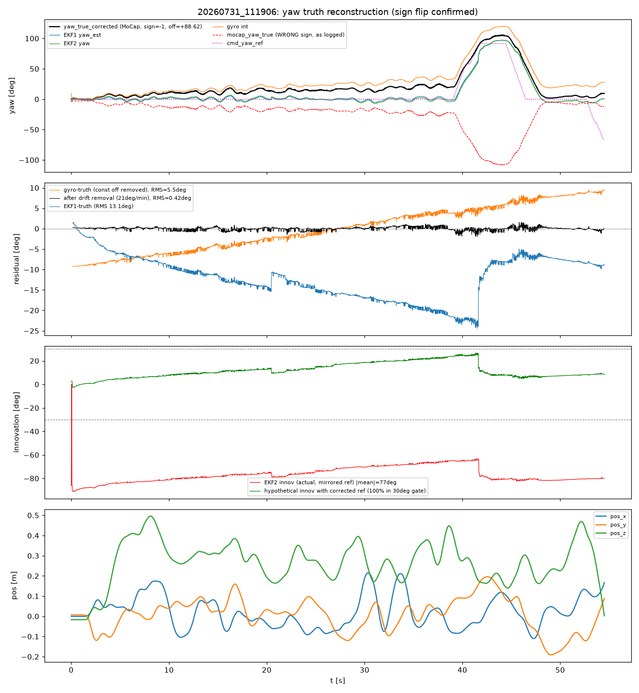

## 2. 多層防御の実弾試験(EKF2セーフガード)

- ヨー観測イノベーション: 範囲−91.3〜−63.4°、|平均|76.9°。**2723/2723観測(100%)が
  30°ゲートで棄却**(ゲート縁への最接近でも33°のマージン)。
- 融合停止ラッチ(25連続棄却): **t≈1.1s(離陸t≈2.4sの前)に発動**。全飛行がラッチ下。
- ekf2_status=33(fresh=1∧fused=0∧healthy=1)が全行 — **「基準は届いているが正気でない」
  シグネチャを地上から実時間検出可能**(次回プリフライトチェックの根拠)。
- 飛行状態再アンカー未発動の理由: 発動条件のうちyaw_obs_fusedのみ不成立
  (他条件は全成立を確認)— 汚染基準下でψ0を取り直さないフェイルセーフが機能。
- **τ_bm適応の実データ検証**: 磁気全棄却のコースト窓でEKF1のb_mは実測**τ=119.95s**で
  ゼロ回帰(設計120sと0.04%一致)、**EKF2はビット単位で完全一定**(準凍結ホールド)。
  設計式の差が実データで直接可視化された。

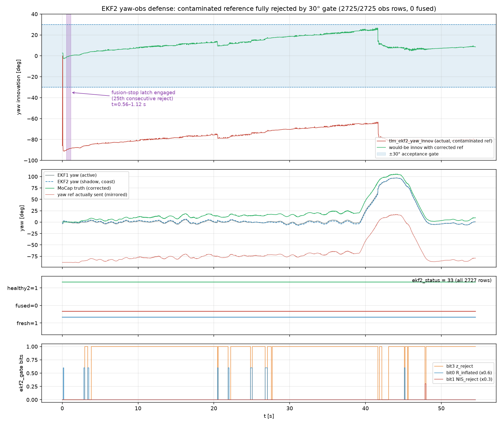
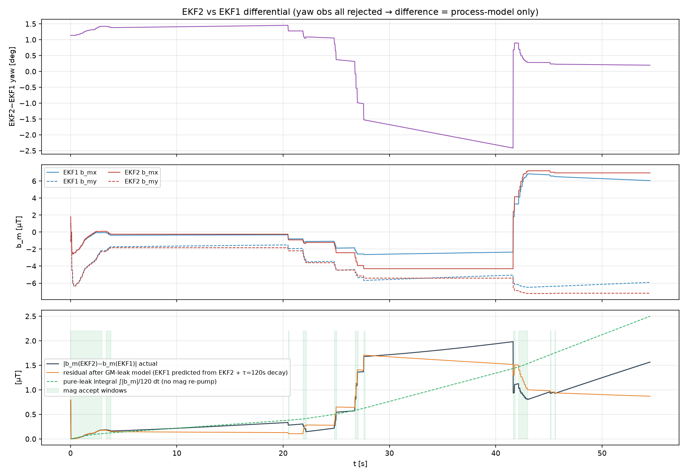

## 3. ヨー精度(正解ヨー基準)と7/27比較

| 系統 | 今回 RMS / max / ドリフト | 7/27 log1 | 7/27 log2 |
|---|---|---|---|
| EKF1 | **13.27° / 23.9°**(バイアス−12.3°+形状5.0°) | 17.97° | 5.80° |
| EKF2(コースト) | 14.74°(EKF1の複製、誤差相関0.988) | — | — |
| ジャイロ積分 | 10.81° / **+21.2°/min** | 4.19° / +1.55°/min | 0.42° |
| Madgwick | 8.57° / +16.6°/min | 3.85° | 0.69° |

- **EKF1劣化機構は7/27と定量再現**: 誤差〜b_m回帰 感度1.96°/µT(R²=0.80)、
  暗黙|B0h|=29.3µT、b_m成長率0.155µT/s(7/27: 0.154-0.162)。|b_m|最終8.46µT
  (EKF2は10.01µT)。
- **回頭による可観測性回復を初実測**: +90°回頭終盤 t=41.64s の磁気受理の瞬間、
  EKF1誤差が**−23.0°→−11.0°へ一段でジャンプ**(b_m_x −2.35→+4.13µT)。
  ヘディング変化がψ/b_m縮退を破る理論の真値付き実証 — オートチューンの
  回頭マニューバ設計を支持。
- 回頭中の悪化はほぼ無し(ホバ13.2° vs 回頭13.6°、実効遅れ0.085s)。7/17の21.9°級は
  再現せず(ランプ中は磁気凍結でEMA遅れがψに入らない構造)。
- 制御構造の恒等式確認: ctrl誤差(cmd−EKF1)RMS 2.62° vs true誤差13.9° —
  **真のヨー誤差はほぼ全てEKF1推定誤差**(0°指令で実機が+15〜22°へ流れた原因)。
- **新規懸念**: ジャイロ積分+21.2°/min・Madgwick+16.6°/minは7/27の約14倍。
  振動誘起バイアス疑い(プロペラ・マウント点検推奨)。移動ベースヨー構想の
  コースト前提に関わるため要追跡。

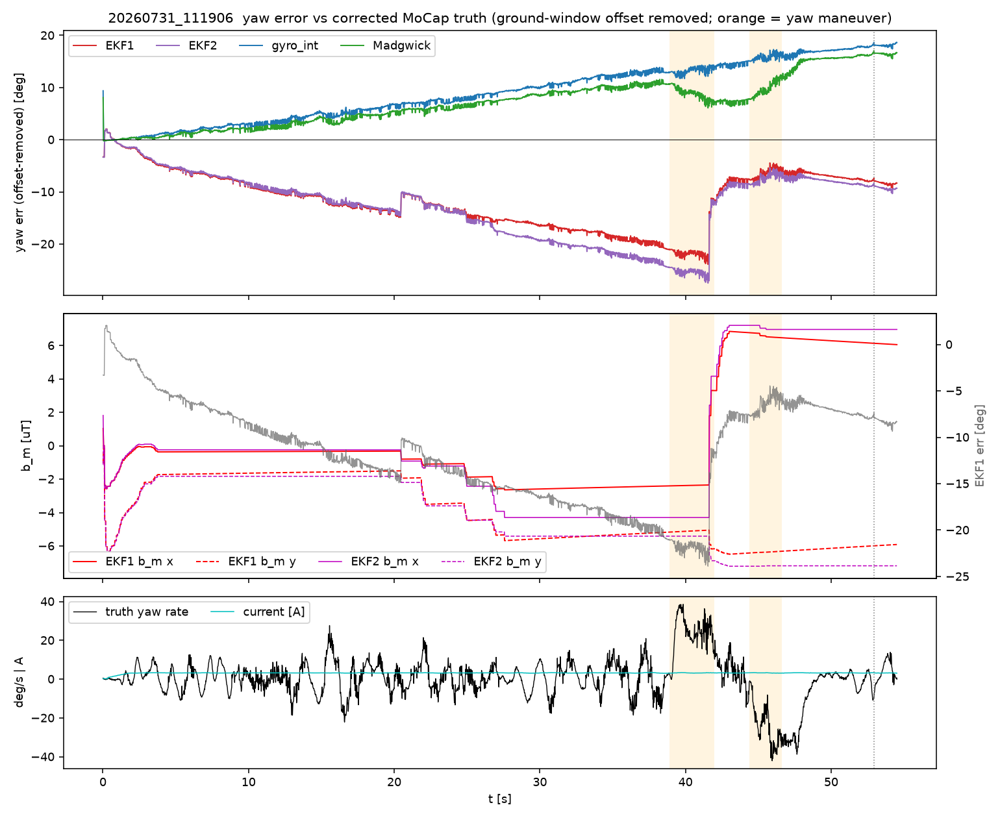
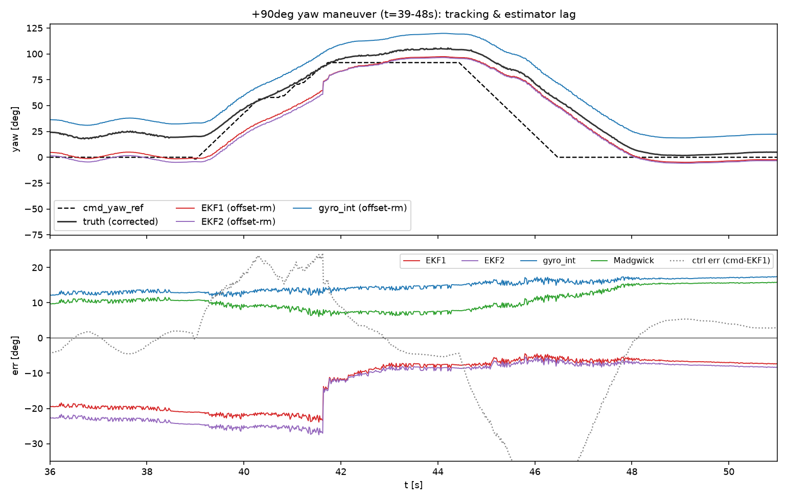

## 4. リプレイ救済(v6フル再構成)

FFプロファイル`研究室_DroneX_20260713`でΔB̂再構成が実機ログと0.6〜1.2%一致
(アクティブプロファイル確定・Code Identity級)。正解基準を注入した3ケース:

| ケース | 形状RMS | 備考 |
|---|---|---|
| (a) 正解基準でヨー観測融合 | **0.406°** | 融合100%、innov RMS 0.42°、飛行再アンカーt=11.7s発火→磁気棄却率94%→17% |
| (b) ヨー観測なし(実飛行EKF2相当) | 2.57° | 挙動クラス実機一致 |
| (c) EKF1互換モード | 2.73° | 同上 |

- 完全なCode Identityはログがアーム後開始のため不成立(地上アンカー・I_idle・EMA初期値が
  復元不能)。**次回はアーム前2s以上からログ開始が必須**。
- **真のFF残差の直接測定**: 機体固定成分 **c_body=(+0.44, −7.41)µT、|7.4µT|**
  (|ΔB̂|≈112µTの6.6%)。7/27の13〜16µTに対し約半分 — **飛行間で同オーダーだが2倍変動**。
  magbias永続層は「一度きりの固定値」より「毎飛行の自動学習・上書き」を支持する初の直接証拠。
- **magbias抽出成功**: Δb=(−0.41, −7.64, 0*)µT、fit RMS 2.51µT、ヨー励振106°。
  直接測定と0.9µT一致で相互裏付け。プロファイル: `analysis_20260731/magbias_20260731_recovered.json`
  (*Δb_zはアーム前地上窓が無くnull→0。z学習は次回)。
- **新規の設計知見**: **FF z軸が≈17µT過補正**(ΔB̂_z=+21.3µTに対し実測z変化+3.9µT)で
  z-gate(12µT)が飛行中94〜95%発火(7/27の60〜63%から悪化)し磁気融合をほぼ封鎖。
  水平magbiasだけではz-gateは開かない — Δb_z学習(要アーム前地上窓)または
  z-gate/FF z軸の見直しが次の改修候補。

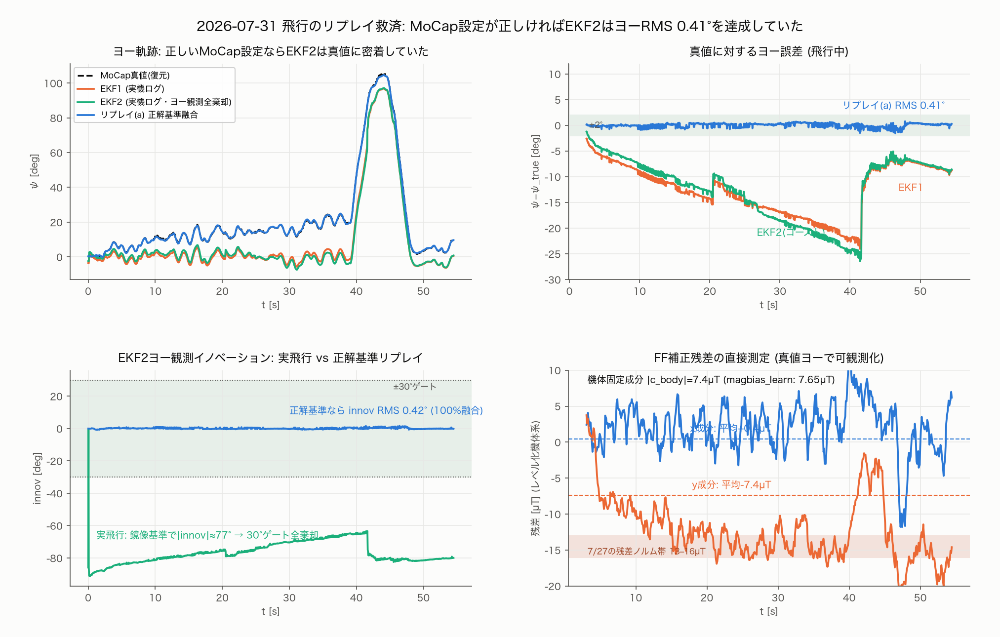
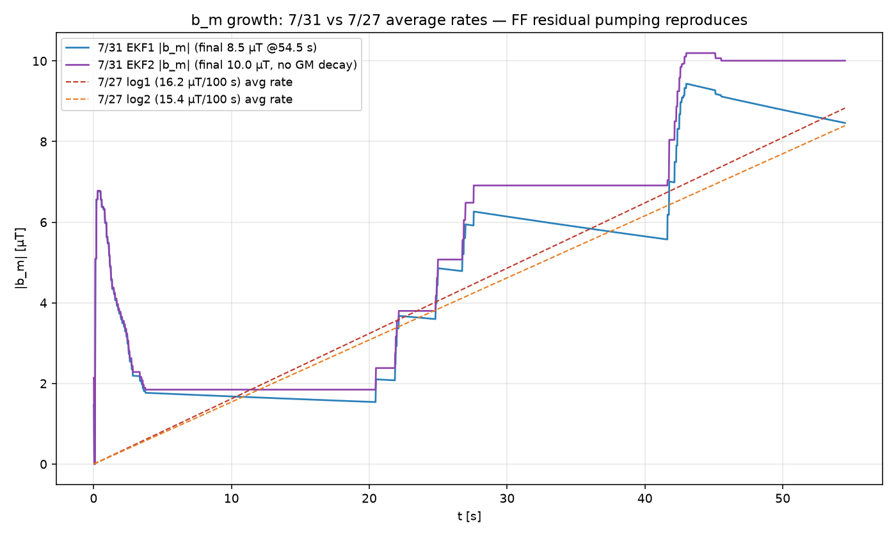
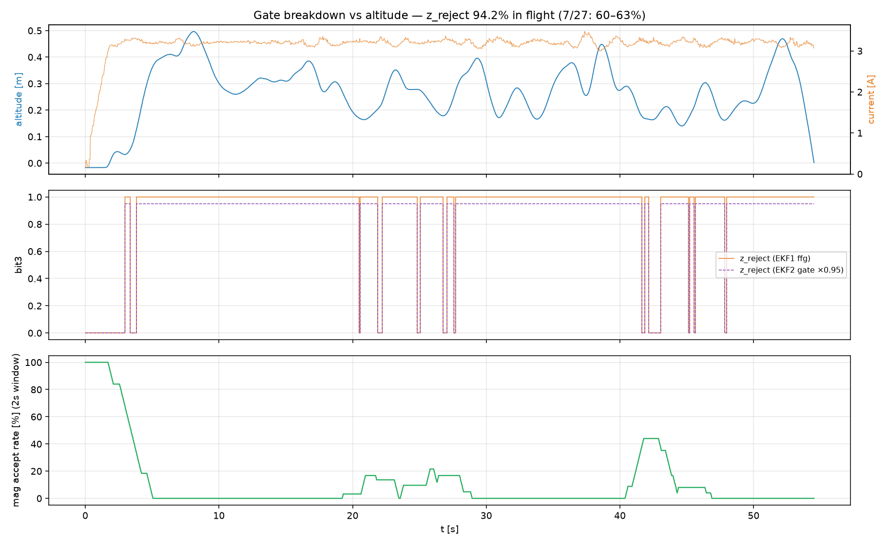

## 5. オプティカルフロー初実飛行データ

- **burst読み全行成立**(懸案解決)、init_retry=0、range_valid中のvel_valid率100%、
  飛行中ドロップアウトゼロ。dt=20-24ms(50Hzスロット安定)。SQUAL飛行中平均86.5/最小53
  (ゲート25を一度も割らず。回頭中55-70に低下するが精度影響なし)。
- 精度(MoCap微分×正解ヨー機体系基準との比較):

| 指標 | x軸 | y軸 |
|---|---|---|
| ホバ実効ノイズσ(白色成分) | **0.075 m/s** | **0.054 m/s** |
| 低周波コヒーレンス(0.1-0.5Hz) | 0.96 | 0.96 |
| スケール(要flowcal) | 1.11-1.16 | 1.16-1.26 |
| 遅延(テレメトリ経路込み) | +31 ms | +62 ms |

- **設計想定σ≈0.075-0.1 m/sを達成**。残差ほぼ白色(2s窓で√N圧縮が効く)、ただし
  単発0.4-0.9 m/sスパイクあり → 設計のクランプ+NIS棄却は必須で妥当。
- 較正課題: スケール1.1-1.3、**取付回転φ0=−9.4°**を検出 → flowcal較正飛行で対処。
- **機構A(速度整合ヨー)は条件付きGO**: 2s窓σ_ψ≈2.5-4°/窓の設計要求に実測σで到達見込み。
  ただし今回‖v‖≥0.3m/sは0.8%のみ — 実証には意図的な並進軌道が必要。

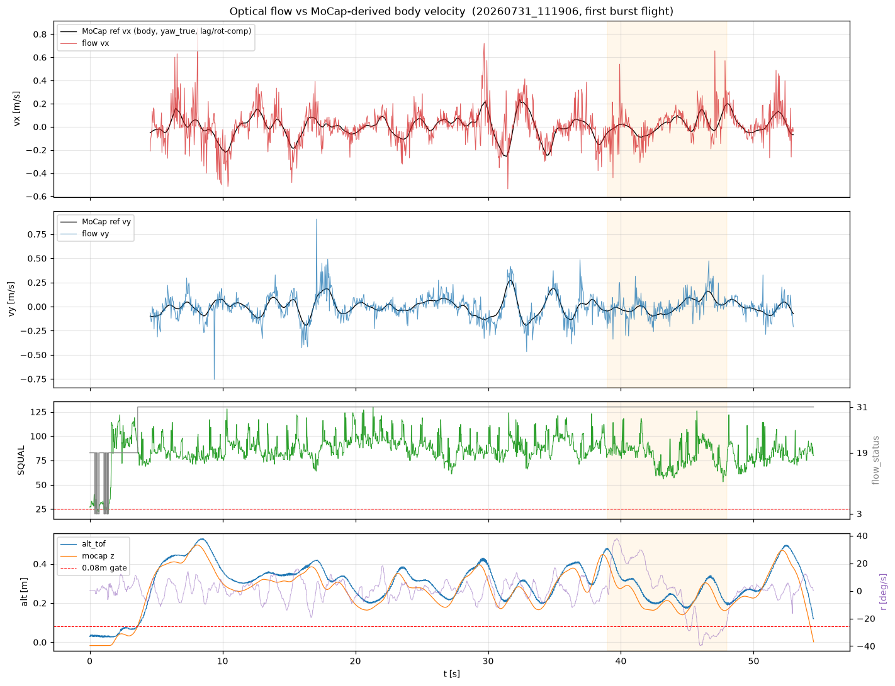
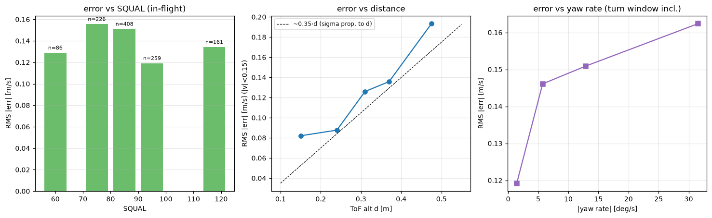

## 6. 位置制御性能(参考)

定常ホバ: XY 86/75mm、半径RMS **114mm** / P95 194mm — 7/27(79/52mm)比1.4〜2.2倍悪化。
高度に0.15Hz・峰々348mmの低周波振動、回頭中は平均−73mm沈下。ヨーとは別系統の調査課題
(電圧低下・ジャイロ振動との交絡候補)。

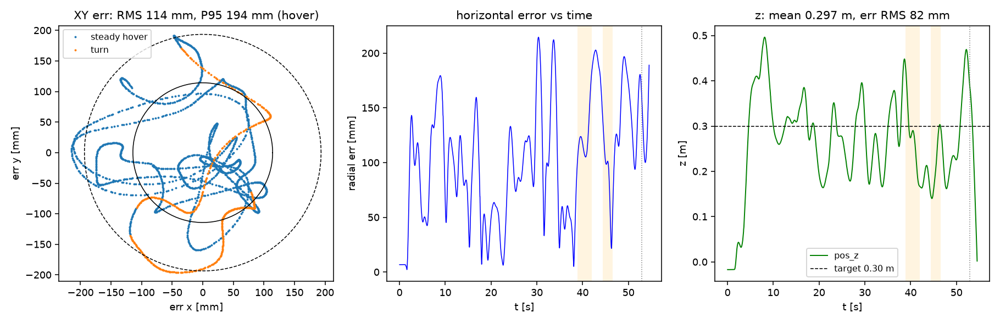

## 7. 次フライト手順(最重要)

**A. MoCap設定修正**: `pc_server/config/control.json` の attitude_transform が
**既定値(yaw_sign=+1, offset=0°)に戻っていることを確認済み — このまま飛ぶと再発する**。
`yaw_sign=−1` を設定・永続化し、offsetは当日較正(アーム直後の静止でPC表示の
yaw_true≈0°になるよう調整。7/27・7/31とも≈+88.6°)。
**【訂正 2026-07-31 18:20飛行解析】この対策は不十分だった**: 18:20飛行で
yaw_sign=−1/offset=+89.9°を正しく設定して飛行したが、ワイヤ送信は
attitude_transform を通らない(表示列にしか効かない)ため融合0%が再発した。
根治は本コミットの P0 改修(ワイヤへの較正適用+アーム相対基準)—
`FLIGHT_ANALYSIS_20260731_1820.md` §1/§8 参照。設定自体は表示・ログ列の
正しさのために引き続き必要。

**B. プリフライトチェック(新設)**:
1. 手回しテスト: 機体を+30°回してPC表示yaw_trueが同方向・同量動くこと
2. **ekf2_statusチェック: 離陸前にfusedビット=1 かつ |innov|<10° を確認。
   status=33のままなら離陸中止**
3. **ログはアーム前2s以上から開始**(地上アンカー・I_idle・Δb_z復元に必須)

**C. 飛行メニュー**: シャドーで融合成立確認 → +90°回頭込みホバ(飛行状態再アンカー初発動・
b_m挙動確認)→ 余力があれば±30cm並進往復(機構Aデータ+flowcal)。
magbias適用A/Bは融合成立を確認した後の飛行で。

## 8. 成果物

- 図13枚+検証図2枚: `docs/analysis_20260731/*.png`
- スクリプト・統計JSON: `docs/analysis_20260731/scripts/`(正解復元fit・防御解析・
  ヨー精度・フロー精度・リプレイ・横断検証)
- magbiasプロファイル(救済抽出): `docs/analysis_20260731/magbias_20260731_recovered.json`
  — 使用時は `pc_server/data/magbias_profiles/` へコピーしてUIから適用
  (binding=null警告はff_state.json不在のため。適用はヨー観測融合成立後を推奨)
