# 飛行ログ解析(2026-07-31 18:20): Phase 1シャドー第2飛行 — PCワイヤ送信バグの確定と融合デッドロック、MoCap 90°別解グリッチの発見

対象ログ: `logs/flight_logs/20260731_182025_position.csv`(v6・136列・2760行・55.2s、
est_mode=1、yaw_ref_source=mocap、ホバリング+回頭マニューバ(+88°/−125°指令)、
電圧4.17→3.47V)

位置づけ: `MAG_AUTOTUNE_DESIGN.md` §5 の Phase 1(EKF2シャドー検証)第2飛行。
11:19飛行(`FLIGHT_ANALYSIS_20260731.md`)の§7A対策どおり attitude_transform を
yaw_sign=−1 / yaw_offset=+89.9° に設定して飛行したが、**ヨー観測は再び融合0%**。
本解析でその根本原因が **PC側ワイヤ送信バグ**(較正が表示列にしか効かない)+
**ファーム側ラッチの解除経路欠如(デッドロック)** であることを確定し、あわせて
MoCapの**約90°別解グリッチ**を新規発見した。11:19解析§1の「鏡像基準がワイヤに
乗った」解釈はこの結果により訂正した(同文書冒頭の【訂正】注記参照)。

解析方法: マルチエージェント解析(真値復元→デッドロック機構/ヨー精度/フロー較正
/リプレイの並列→横断照合)。全定量主張は実データ再計算で照合済み。
図・スクリプト・統計は `docs/analysis_20260731_1820/` に格納。

---

## 0. 結論サマリ

**「設定を直したのに直らなかった」飛行 — 原因は設定ではなくコード2箇所+MoCap品質。**

1. **融合ゼロの根本原因 = PCワイヤバグ+ファームのデッドロック**:
   PCのワイヤ送信は `sent = −生ヨー(heading×wire_sign)` であり、設定パネルの
   yaw_sign/yaw_offset は**表示・ログ列(`mocap_yaw_true_deg`)にしか適用されない**。
   機体に届いた基準は真値−90.434°一定(11:19は−88.62°一定)→ 30°ゲートが全棄却 →
   **25連続棄却ラッチが t=1.00s(離陸 t=3.42s の前)に発動**。ラッチに飛行中の
   解除経路が無く(解除条件が融合成立を要求するキャッチ22)、恒久デッドロック。
2. **MoCap 約90°別解グリッチを新規発見**: 728行 26.4%・54ラン・最長3.56s。
   フレーム間ジャンプ中央値94.9°/行(正常p99=5.4°/行、ジャイロ上限≈0.6°/行)で
   機械判別可能。PC側 cont_flip(180°専用)が誤補正しログ列を汚染 —
   「EKF1 RMS 80°」はこのアーチファクト(復元真値比では12.5°)。
3. **正解基準でもグリッチだけでラッチが飛行中に発動する**(リプレイ実証:
   整列のみのケースは t≈25s で永久死)→ ファーム側解除経路(P1)と
   PC側連続性ゲート(P2)の**両方が必要**という決定的証拠。
4. **フロー較正は実質成功**: 軸マッピング修正+K適用でフィット回転+91.7°
   (期待90.43°=評価基準系のフレームオフセット)・xゲイン1.04。ホバ実効σ
   0.041/0.055 m/s、純フローDRドリフト1.0cm/s。y残差ゲイン0.81は過補正疑い。
5. **EKF2はコーストのみでもEKF1より良い**: 復元真値比 RMS **9.0° < EKF1 12.5°**。
   リプレイでは正解基準なら **RMS 1.69°・融合率100%**。
6. **magbias再現性の2点目**: Δb=(−2.90, −7.96)µT(|8.47µT|)。11:19の
   (−0.41, −7.64)µT と y成分0.3µT差で再現。
7. 本コミットの改修 P0(ワイヤ較正適用+アーム相対基準)/ P1(ソフト再捕捉=
   ラッチ解除経路)/ P2(連続性ゲート)で上記すべてに対処(§8)。

## 1. 正解ヨーの復元とワイヤ送信バグの確定

- 正解変換 `yaw_true = wrap(−yaw_raw + 90.434°)`(オフセットは地上静止窓
  t=[0.17, 2.0]s でジャイロ積分にアンカー)。符号判定は決定的:
  s=−1 でドリフト除去後RMS **1.34°**(max 5.7°)、s=+1 では13.0°。
  設定パネル値(−1/+89.9°)とフィット(+90.434°)の差は0.53°=当日較正の残差。
- **機体に送られた基準は `sent = −yaw_raw`**(全行RMS 4×10⁻⁵°)=
  **真値−90.434°の定数オフセット**(inlier行 mean −90.434°・std 4×10⁻⁵°)。
  11:19も同構造で sent=−heading(RMS 2×10⁻⁵°)= 真値−88.62°一定。
  両フライトの差(−88.6 vs −90.4)は機体設置向きの差のみ。
- コード上の機構(`pc_server/core/session.py` の CMD_POS_ERR 組み立て):
  ワイヤへは `heading(生方位)× wire_sign(座標マッピング由来)` を送るだけで、
  attitude_transform(yaw_sign/yaw_offset)は `mocap.py` の yaw_true 計算=
  表示・ログ列にしか通らない。**設定パネルでいくら較正してもワイヤは変わらない**。
- 11:19解析の「鏡像基準がワイヤに乗った」は誤り: 鏡像化していたのは誤設定
  (+1/−91.3°)の**表示列だけ**(`mocap_yaw_true_deg = +heading−91.3°` を全行RMS 0.0°で
  確認)。ワイヤは両フライトとも同じ −生ヨー。`FLIGHT_ANALYSIS_20260731.md` に
  【訂正】注記を追加済み。

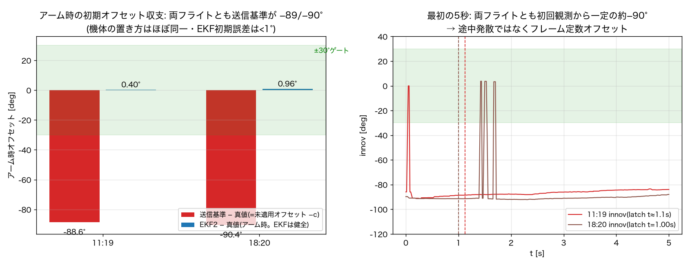

## 2. デッドロックの機構(t=1.00sラッチ)

- 初回ヨー観測(t=0.00s)から innov=**−89.7°**。観測レート23.5Hzで25個目の観測
  **t=1.00s で融合停止ラッチ発動**(離陸 t=3.42s・flying遷移 t=5.20s の前。
  11:19 は t≈1.1s)。以後全行 ekf2_status=33(fresh∧未融合∧healthy)、
  fusedビットは全飛行で一度も立たず。
- **would-be イノベーション(正基準なら)**: mean +4.2° / RMS **8.5°** /
  max **21.3°** で **100%が30°ゲート内** — 基準さえ正しければ全数融合できた。
- ラッチのコード経路(`yaw_estimator_kf2.cpp` `updateYawObs()` L431-443):
  `yaw_fusion_stopped_` の解除は `resetYawObsState()` = reanchor / reseedYaw の
  **地上経路のみ**。飛行状態再アンカー(flightReanchor)は発動条件に
  `yaw_obs_fused` を要求するため、「融合が止まっているから再アンカーできず、
  再アンカーしないとラッチが解けない」**キャッチ22**。
- グリッチ行の偶然ゲート内観測(+95°グリッチが−90°オフセットを打ち消す)が
  325観測(25.1%)あったが、すべてラッチ後のため融合されず(結果的に
  グリッチ汚染から推定器を守った側面もある)。

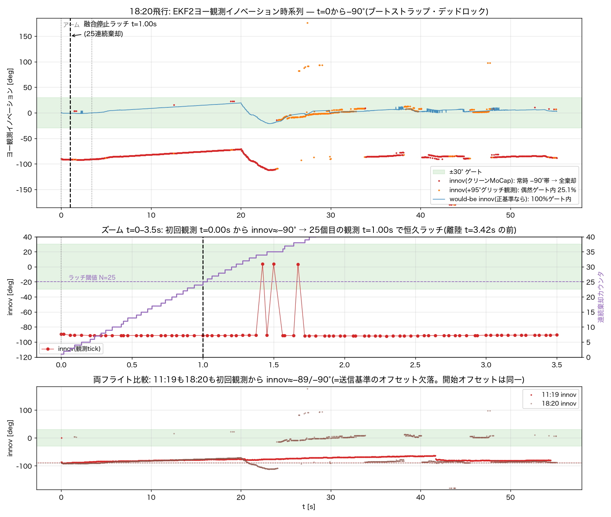

## 3. MoCap 90°別解グリッチと「RMS 80°」アーチファクトの分解

- **グリッチの実態**: 728行(26.4%)・54ラン・最長3.56s(t=30.1s)・1s超が5ラン。
  真値からの偏差は中央値89.5°(p10-p90: 88.0-94.4°)の**約+90°別解**。
- **物理的に不可能なジャンプ**: グリッチ開始行のフレーム間ジャンプ中央値
  **94.9°/行**に対し、正常行のp99=**5.4°/行**、ジャイロ実測レート上限≈**0.6°/行**。
  → 閾値1つで機械判別できる(P2連続性ゲートの根拠)。位置は連続
  (開始行の位置ジャンプ中央値0.8mm)= 位置ソルバは正常、**姿勢ソルバのみの別解**。
  マーカー配置の回転対称性が原因と推定(§9で非対称化を推奨)。
- **cont_flipの誤爆**: PC側ヨー継続性ガード(180°専用)が95°ジャンプを180°反転と
  誤判定し、全ログで**376行を誤180°補正**(飛行窓では323行)→
  `mocap_yaw_true_deg` 列を二重に汚染。
- **「EKF1 vs ログ列 RMS 81.3°」の分解**(飛行窓): クリーン1432行 RMS 13.3°
  (分散寄与1.6%)/ 誤180°補正323行 RMS 171.5°(寄与**58.9%**)/
  +90°グリッチ685行 RMS 96.4°(寄与39.5%)。**復元真値比では12.5°** —
  「RMS 80°」は推定器の破綻ではなく**基準列汚染のアーチファクト**。

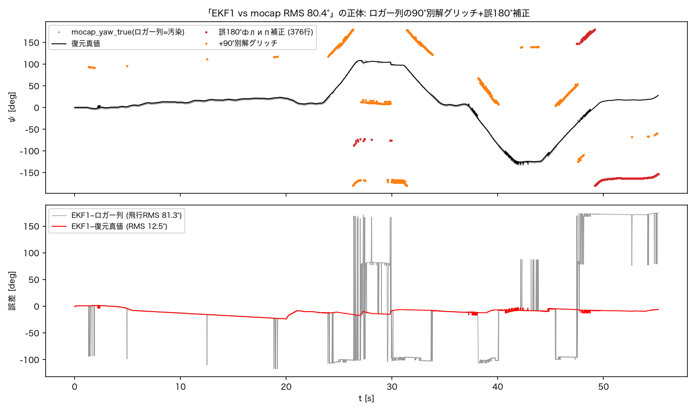

## 4. ヨー精度(復元真値基準)

| 系統 | 飛行RMS(全行) | クリーン行のみ | max | ドリフト |
|---|---|---|---|---|
| EKF1 | 12.5° | 13.1° | 23.9° | +10.8°/min(誤差傾き) |
| EKF2(コースト) | **9.0°** | **10.1°** | 21.3° | +4.9°/min |
| ジャイロ積分 | 2.7° | — | 5.4° | +3.6°/min |
| Madgwick | 4.4° | — | 12.0° | +8.7°/min |

- **EKF2がEKF1を初めて明確に上回った**(11:19はコースト複製で同等だった)。
  差の主因は t=20.1s の**磁気ソフト再捕捉**(EKF2ゲート bit7 発火)で誤差
  −19°→回復し、以後5s平均|誤差|≈5°で安定(EKF1は−8〜−12°)。τ_bm適応
  (準凍結ホールド)による b_m 保持も寄与(b_m〜誤差回帰: EKF2感度3.44°/µT・
  R²=0.74)。
- 11:19の新規懸念だった**ジャイロドリフト+21.2°/minは再現せず**(今回+3.6°/min)。
  振動誘起説は今回データでは支持されない — 個体/取付/温度の一過性として追跡継続。
- 位置制御(参考): 定常ホバ半径RMS **76mm** / P95 121mm — 11:19(114mm)から
  改善し7/27水準へ回復。z-gate棄却は飛行中**77%**(11:19の94%から改善したが
  依然高い — FF z軸過補正の課題は未解決のまま)。電圧は終盤3.47V。

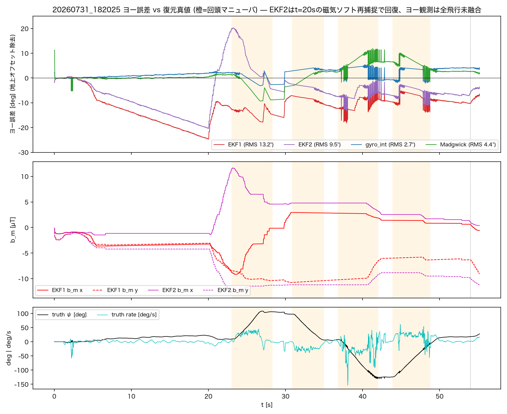
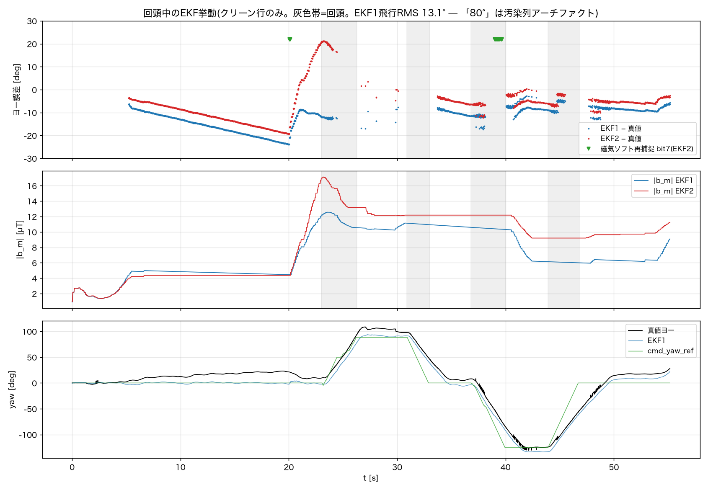

## 5. リプレイ実証(v6フル再構成、`scripts/run_replays.py`)

| ケース | 融合率 | ラッチ | ヨーRMS(真値比) |
|---|---|---|---|
| R1: 実送信基準+現行実装 | **0%** | 25個目で発動(実機再現) | 形状10.6°(コースト) |
| R2: 正解基準+現行実装 | **100%** | なし | **1.69°**(innov RMS 1.60°) |
| R3a: 初回整列のみ(グリッチ残存) | 43.1% | **t≈25sで恒久発動** | 2.03° |
| R3b: 整列+グリッチ除去 | **100%** | なし | **1.69°** |

- R1が実機のデッドロック(融合0%・25個目ラッチ)をリプレイで再現 —
  機構理解のCode Identity級裏付け。
- **R2が本来の性能を反実仮想で実証**: 正解基準なら RMS 1.69°・融合100%・
  飛行状態再アンカーも発火。Phase 1 の目標値(<2°)を実飛行データで達成。
- **R3aが「基準を直すだけでは足りない」ことを実証**: オフセット整列済みの
  基準でも、グリッチ行は基準側が+90°飛ぶため棄却が続き、**25連続棄却に達する
  グリッチランが6回**(61/32/44/83/45/54観測)— 最初の t≈25s のランでラッチが
  再発し永久死。→ P1(解除経路)+P2(グリッチ除去)の両方で初めてR3b=100%になる。

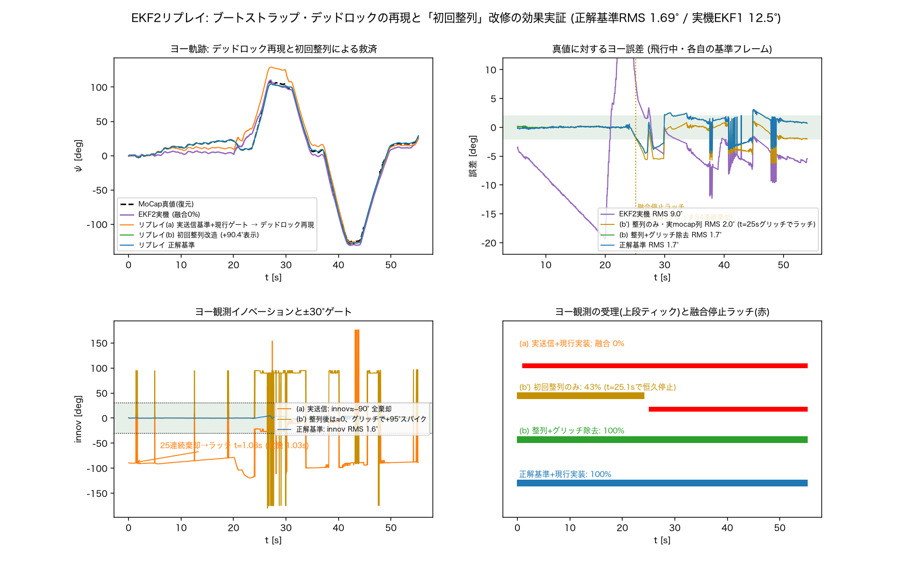

## 6. フロー較正評価(実質成功・dy過補正疑い)

較正チェーン: 11:19(既定K=diag(450,450))の実測ゲイン x1.154 / y1.293 =
**519/450, 582/450** → フロー較正パネルで2×2 K設定 → 18:20はK適用済で飛行。

- **軸マッピング修正(コミット705dd63)の実飛行検証成立**: 機体系フローvs
  MoCap基準速度の2×2フィットが**純回転+91.7°**(2sブロックブートストラップ
  90%CI: 87.5-96.2°)。期待値は+90.43°(=評価基準系に残るMoCapフレーム
  オフセット)で、CI内に整合 — 90°級の軸入替はもう存在しない
  (残差+1.2°は取付ひねり候補だが有意でない)。
- **残差ゲイン x1.04 / y0.81**: xは較正成立。**yはCI90 [0.69, 0.94] が1を含まず
  過補正疑い**(K m11=582が過大の可能性)。ただし回頭窓のみではy1.04で、
  低速ホバ域のフィット劣化(全体相関0.38)混入も否定できない —
  確定には意図的な並進較正飛行が必要。
- **ホバ実効σ(ロバスト)**: x **0.041** / y **0.055** m/s(11:19: 0.058/0.056)—
  設計想定σ≈0.075-0.1を大幅に下回る。
- **純フローDR(dead reckoning)**: 終端誤差 **0.49m / 49.5s = 1.0cm/s** —
  機構A(速度整合ヨー)・フロー観測導入の実用性を裏付ける水準。

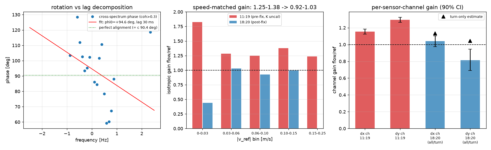
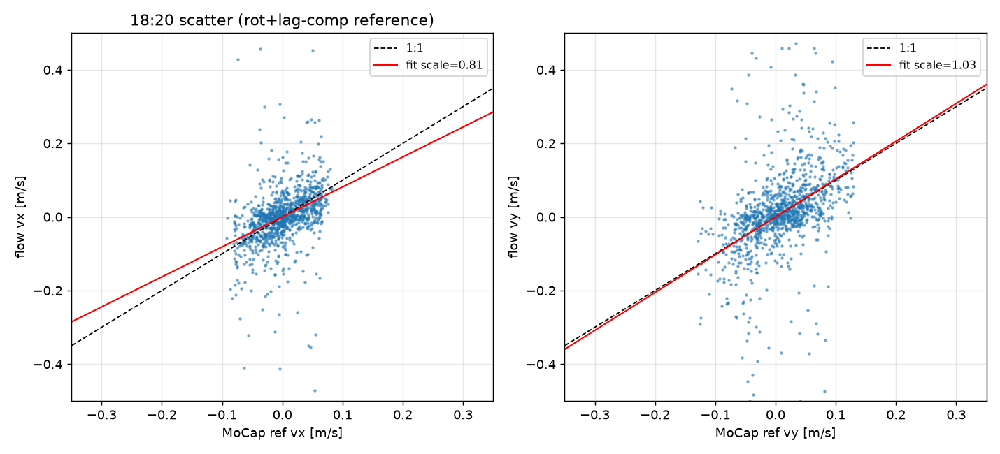
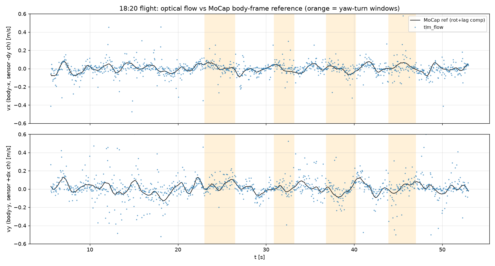
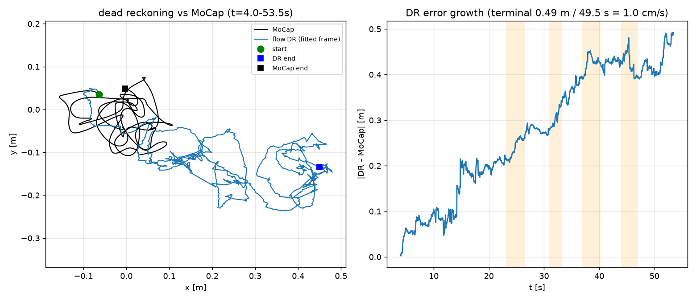

## 7. magbias再現性(2点目)

- 復元真値でmagbias抽出: **Δb=(−2.90, −7.96, 0*)µT・|8.47µT|**、fit RMS 2.90µT、
  ヨー励振239°(11:19の106°より良条件)。*z はアーム前地上窓なしのため今回もnull。
- **11:19の(−0.41, −7.64)µT と比較: y成分は0.3µT差で再現**。x成分は2.5µT差
  (励振範囲・グリッチ真値ブリッジの影響を含む)。y≈−7.8µT の機体固定
  ハードアイアン残差はフライト間で安定 — magbias永続層の有効性を支持する
  2点目のエビデンス。プロファイル:
  `analysis_20260731_1820/scripts/magbias_20260731_1820.json`
  (適用はヨー観測融合成立後のA/B飛行から)。

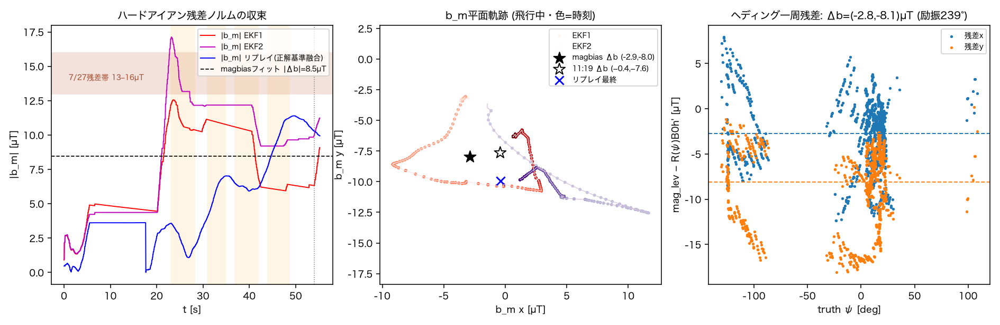

## 8. 改修P0-P2(本コミットで実装)

本解析の確定事実に基づく改修。**仕様の細部(閾値・解除条件・列意味)は
本コミットの実装が正**(`MAG_AUTOTUNE_DESIGN.md` §2.1/§3 の改訂注記参照)。

- **P0(PC・ワイヤへの較正適用+アーム相対基準)**: CMD_POS_ERR のヨー基準を、
  attitude_transform 適用済みの yaw_true 系列から生成する。さらにアーム検知時の
  yaw_true を ψ_arm として保持し `wrap(yaw_true − ψ_arm)` を送る**アーム相対基準**
  とする — 機上ヨーはアームで0リセットされるためフレーム原点が構造的に一致し、
  当日オフセット較正への依存(今回0.53°残差、11:19は設定忘れで全損)を排除する。
- **P1(ファーム・ヨー観測ソフト再捕捉=ラッチ解除経路)**: 融合停止ラッチに
  飛行中の解除経路を追加(ゲート内観測の連続成立で再捕捉、ekf2_status bit7 で
  通知)。flightReanchor のキャッチ22も解消。一過性の基準異常から全飛行を
  失わない。
- **P2(PC・連続性ゲート)**: MoCapヨーのフレーム間ジャンプをジャイロ整合閾値で
  棄却する一般ゲートに、cont_flip の180°専用判定を拡張(90°別解グリッチ対応)。
  棄却中は基準無効(bit3 落とし=ファームはコースト)。棄却フラグは
  `mocap_flip` 列に記録(`LOG_STRUCTURE.md` §14 注記)。

改修後の期待値はリプレイR3b(融合100%・RMS 1.69°)。

## 9. 次フライト手順(最重要)

**A. プリフライトチェック**(11:19版を改訂):
1. 手回しテスト: 機体を+30°回してPC表示 yaw_true が同方向・同量動くこと
2. **ワイヤ検証(新設・今回の教訓)**: 地上で `tlm_ekf2_yaw_innov_rad` が
   |innov|<10°であることを確認する。**表示列ではなくワイヤ由来の値で確認する**
   (表示が正しくてもワイヤが違った、が今回の敗因)
3. **ekf2_statusチェック: 離陸前に fusedビット=1 を確認。status=33のままなら
   離陸中止**(両フライトとも地上で検出できたシグネチャ)
4. ログはアーム前2s以上から開始(地上アンカー・I_idle・Δb_z復元に必須 — 未達成継続中)

**B. マーカー非対称化(推奨)**: 約90°別解はリジッドボディのマーカー配置の
回転対称性が原因と推定される。マーカー1個の高さ/半径をずらして非対称化し、
Motive側で一意解になることを確認する(P2ゲートは防御であって根治ではない)。

**C. 飛行メニュー**: シャドーで融合成立(fused=1)確認 → 回頭込みホバ
(飛行状態再アンカー初発動・ソフト再捕捉の実機確認)→ magbias適用A/B →
±30cm以上の並進往復(フローdyゲイン確定+機構Aデータ)。

## 10. 成果物

- 図11枚: `docs/analysis_20260731_1820/*.png`
- スクリプト・統計JSON: `docs/analysis_20260731_1820/scripts/`
  (真値復元 `truth_fit_b2.py`/デッドロック `deadlock_analysis.py`/
  ヨー精度 `yaw_eval_b.py`/リプレイ `run_replays.py`+`ekf2_replay_mod.py`/
  フロー `flow_eval.py`+`scale_robust.py`/作図 `make_plots_b.py`+`flow_plots.py`、
  統計は同名 `*.json`)
- magbiasプロファイル: `docs/analysis_20260731_1820/scripts/magbias_20260731_1820.json`
