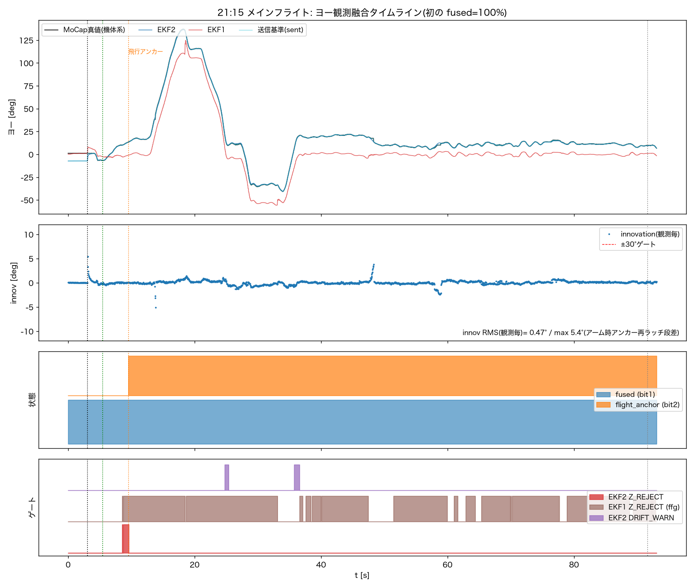
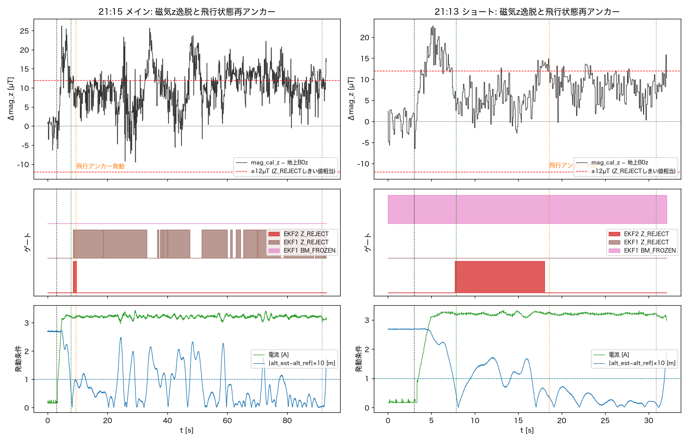
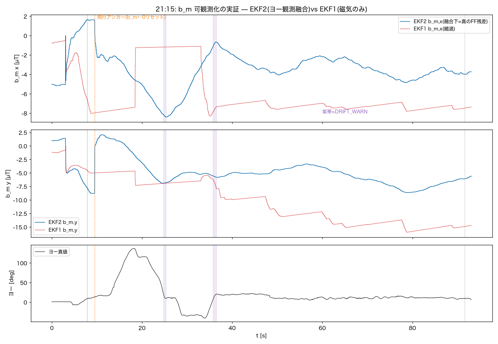
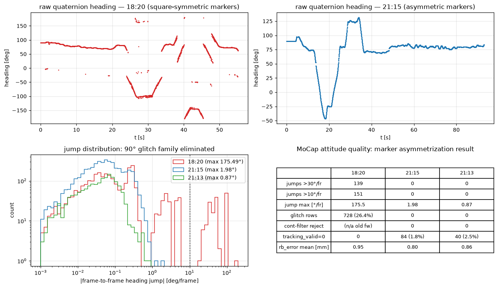
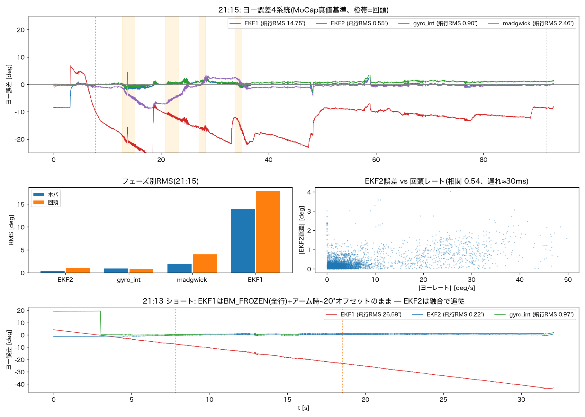
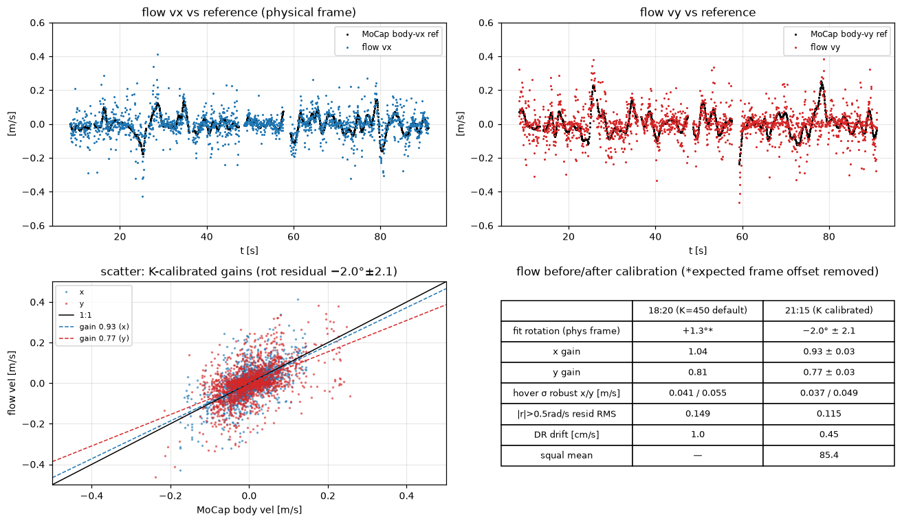
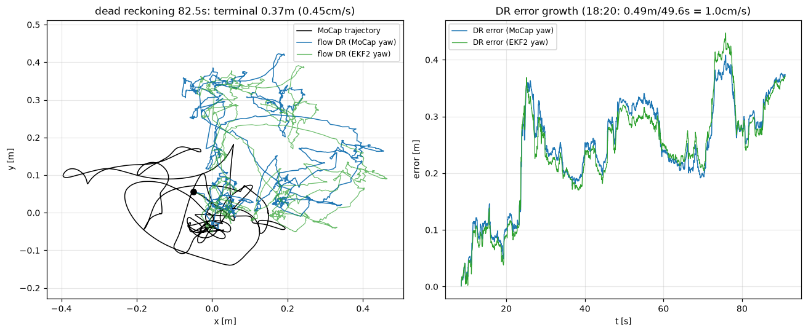

# 飛行ログ解析(2026-07-31 21:13/21:15): ヨー観測融合の初実機成立 — EKF2 追従0.55°

対象ログ:

| | 21:13(ショート) | 21:15(メイン) |
|---|---|---|
| ファイル | `logs/flight_logs/20260731_211304_position.csv` | `logs/flight_logs/20260731_211535_position.csv` |
| 内容 | 1605行・32.1s | 4654行・93.1s、±100°回頭ペア含む(真値レンジ178°) |
| 構成 | est_mode=1(シャドー)、yaw_ref_source=mocap、align=arm、プリロール3s | 同左 |

前提: 改修コミット`ee166b8`(アーム相対アンカー/連続性フィルタ/FWヨー観測ソフト再捕捉/
インターロック/プリロール)適用後の初飛行。加えてユーザーがフロー再較正
(φ0=−1.04°・適用検証済み: `flowcal_20260731_DroneX.json`)と**マーカー配置の非対称化**
(正方対称→前プロペラ2+機体中心1+後部中央1)を実施。

解析方法: マルチエージェント解析(融合/EKF2/磁気系とマーカー/フロー系の並列→横断検証
エージェントが全争点を実データ再計算で決着)。図・統計・スクリプトは
`docs/analysis_20260731_2115/` に格納。

---

## 0. 結論サマリ

**ヨー観測融合が実機で初成立(fused=100%)し、EKF2の機体制御フレーム追従誤差は
RMS 0.55°(21:13は0.22°) — 自由ジャイロ積分(0.90°)を初めて下回り、
リプレイ予測(1.69°)を3倍上回った。** 改修5件・flight_anchor・マーカー非対称化の
すべてが設計どおり動作。

1. **融合**: fused=100%(プリロール含む全行)、innov RMS 0.47°(p95 0.79°、ゲート余裕
   最悪82%)。離陸時点で融合成立=インターロック初通過
2. **飛行状態再アンカー初発動→z-gate根治**: 発動後のEKF2 z棄却0.1%(発動前53%)。
   地上基準のままのEKF1は同一飛行で83%棄却継続=基準差し替えが唯一の差の分離実証
3. **b_m可観測化を実証**: 融合下のEKF2 b_mは178°回頭中も滑らかに残差を追従、
   終値(−3.79, −6.91)µTがmagbias独立推定と初整合。EKF1は鋸歯状の縮退汚染
4. **マーカー非対称化は完全成功**: 90°別解グリッチ0行(18:20は26.4%)、ジャンプ最大
   1.98°/frame=ジャイロ実測上限と一致(全て実回転)。代償はオクルージョン1.8%
5. **21:13でEKF1の縮退故障の決定的実例**: 地上7分待機中にBM_FROZEN+b_g汚染→
   **−90°/min・誤差42°**。同一センサーのEKF2は**0.22°**=融合の防御価値の実証

## 1. 注意: 「PCフレーム」と「機体制御フレーム」の区別

アーム相対アンカー(align=arm)では、送信基準はアーム時の機体ヨー推定へ整列される
(今回anchor=2.25°)。PCログのmocap_yaw_true_degとEKF2ヨーの生差分にはこの設計上の
定数が含まれるため、**性能評価は機体制御フレーム(真値+anchor)で行う**:

| 指標 | 21:15 | 21:13 |
|---|---|---|
| EKF2 制御フレームRMS(真の追従誤差) | **0.547°**(max 4.05°) | **0.218°** |
| EKF2 PCフレームRMS(anchor定数込み) | 2.307°(mean=anchor 2.2529°) | 3.92° |

送信則 `sent = wrap(yaw_true + anchor)` は全行RMS 1.6×10⁻⁵°で検証済み、ラッチ遅延0.0s、
implied anchor=meta記録値と一致。既知化事項: プリロール区間は前セッションのstale
anchorで送信され、アーム再ラッチで**+8.4°段差**(innov最大5.42°@t=3.11s、ゲート余裕
82%、2sで収束、実害なし)— 対策候補はプリロール中のアンカー未ラッチ扱い(bit3=0)。

## 2. 融合品質と各改修の実機動作確認

- **fused(bit1)=100%**(全4654行)。innov: RMS 0.468°(飛行のみ0.458°)、p50 0.17°、
  p99 2.07°。飛行中最大5.07°@t=13.81sはMoCapオクルージョン再捕捉直後(§5)
- **改修5件の動作**: アーム相対アンカー=実証 / 連続性フィルタ=棄却0行で待機正常
  (グリッチ自体が消滅) / FWヨー観測ソフト再捕捉=発動0で待機正常 / インターロック=
  初通過 / プリロール3s=動作(アーム前地上窓が初成立→magbias z成分初取得)
- R_INFLATED(bit0)412行は回頭中の磁気NIS膨張の正常動作。NIS棄却・再捕捉・
  low_trustは0

## 3. 飛行状態再アンカー初動作 — z-gate閉塞の根治

- 21:15: **t=9.531sに発動**(条件成立可能な最早時刻ちょうど。律速=高度保持2s継続)。
  21:13: t=18.547s(低電圧による高度整定振動でalt-hold成立が遅延 — 離陸〜発動間の
  68%がalt-hold違反、最大偏差0.27m)
- **z-gateへの効果**: mag_cal_zは離陸で+10.1µTシフト(地上−19.9→飛行−9.8µT)。
  EKF2のZ_REJECTは発動前53%→**発動後0.1%**(21:13: 95%→0%)
- **分離実証**: 同一飛行・同一磁気環境で、地上B0のままのEKF1は**83%棄却が継続**。
  差はB0基準の差し替えのみ → 18:20で特定した「z-gate 94%閉塞」問題は根治。
  EKF1は稀に開いた瞬間のヨー+18°スナップ(鋸歯)も観測=地上アンカー継続の害を併証

## 4. b_m可観測化の実証(磁気オートチューン構想の核心)

- 融合下のEKF2 b_m: 飛行アンカーで(0,0)リセット後、滑らかに残差へ収束、
  終盤10s中央値 **(−3.79, −6.91)µT**(発動後std 1.6/2.4µT)。178°回頭中も連続
- **ヘディング依存性は小さい**(R² 0.07/0.16、振幅1.4/2.2µT)=b_mの大半は機体固定
  残差 → magbias永続化に好適。EKF1のb_mは鋸歯+単調ラチェット(y −15µTまで滑落=
  自身のヨー誤差を吸収する縮退汚染)で対照的
- DRIFT_WARN(bit6、74行)は±100°回頭ペア直後の2エピソード=ヘディング依存残差の
  再学習(≈1µT/s)の正常検出。融合下では「適応中」フラグとして読める
- ff_supplement回帰: R²=0.388(7/27の0.62はEKF1縮退との交絡による見かけ)。
  可観測化されたb_mの変動は電圧/dutyで4割弱しか説明できず、
  **FF電気モデル拡張の余地は限定的、magbias(定数)化が本命**という設計示唆

## 5. マーカー非対称化の評価 — 完全成功

| 指標 | 18:20(正方対称) | 21:15 | 21:13 |
|---|---|---|---|
| 90°別解グリッチ行 | 728行(26.4%)、最長3.56s | **0行** | **0行** |
| ジャンプ>10°/frame | 151回(最大175.5°) | **0回**(最大1.98°) | 0回(最大0.87°) |
| rb_error平均 | 0.95mm | 0.80mm | — |

- 最大ジャンプ1.98°/frame=ジャイロ実測上限1.95°/frameと一致=**全ジャンプが実回転で
  説明可能**。真値品質: 対ジャイロ短窓形状RMS 0.21°(p95 0.64°)
- 代償: **オクルージョン1.8%**(84行・16ラン・最長0.52s=data_invalid_warn閾値0.5sに
  接触)。再捕捉時の位置跳び最大9.3cm(フィルタ後5.3cm)、飛行中innovスパイク
  (最大5.07°)は全件が再捕捉直後0.6s以内 — 予測ブリッジが吸収し実害なし。
  さらに詰めるならマーカー1個追加を検討

## 6. ヨー精度4系統(21:15、機体制御フレーム・飛行窓)

| 系統 | 飛行RMS | ホバ | 回頭 | max | ドリフト |
|---|---|---|---|---|---|
| **EKF2(融合)** | **0.55°** | 0.40° | 0.97° | 4.0° | −0.07°/min |
| ジャイロ積分 | 0.90° | 0.91° | 0.87° | 4.5° | +0.75°/min |
| Madgwick | 2.46° | 1.97° | 3.97° | 8.9° | +2.26°/min |
| EKF1 | 14.75° | 13.98° | 17.80° | 26.6° | +6.37°/min |

- EKF2誤差は回頭レートと相関0.54・回帰勾配≈28ms=**実効遅延約30ms**が残差の約半分。
  推定器自体の形状誤差は0.4°級
- リプレイ予測(1.60-1.69°)を3倍上回った要因: (a)旧予測は18:20のグリッチ橋渡し真値に
  よる下限推定、(b)マーカー非対称化でmocap姿勢品質が向上
- **21:13のEKF1故障**: ffg=BM_FROZEN全行(起動後7分の地上待機中に‖b_m‖>20µT発散・
  凍結、解除経路なし)+汚染b_g→**−90°/minドリフト・誤差max 42°**。ジャイロ積分は
  0.97°と健全=生センサーは無罪。EKF2は同条件で0.22°

## 7. フロー較正適用後の評価

- **残留回転 −2.0°±2.1 ≈ ゼロ**(18:20は+91.7°) — 軸修正+較正(φ0=−1.04°)の適用成功
- デッドレコニング: 終端0.374m/93.1s=**0.45cm/s**(EKF2ヨー使用0.371m=MoCapヨー同等)
- ホバσ 0.037/0.049 m/s(過去最良)
- **残課題: y軸ゲイン0.77(約25%過大補正)が2フライト連続で再現** — 地上の手持ち較正
  では現れない飛行時特有の成分と確定。原因究明(移動時ロール結合/高度スケール
  非対称)または飛行データからのky補正が必要
- 機構Aデータ: ‖v‖≥0.3m/s持続区間なし(p95=0.16m/s) — 0.3〜0.5m級連続往復の
  飛行計画が引き続き必要

## 8. magbias 3点目と方針修正

- 21:15抽出: **Δb=(−3.43, −12.12, +10.02*)µT**、fit RMS 2.85µT、励振177.8°
  (*z成分はプリロールによる地上窓で初取得。FF z残差+環境勾配の合算)
- x成分は18:20(−2.90)と0.5µTで再現。**y成分は−12.1µTで従来(−7.6/−8.0)から4.2µT乖離**
  →「y≈−7.8µTで安定」の2点仮説は3点目で崩壊。**適用プロファイルは複数フライト
  平均で作成すべき**(毎飛行自動学習の方針をさらに支持)

## 9. 次のステップ

1. **Phase 2(est_mode=2でヨー角制御): GO**。前提(融合100%・追従0.55°/0.22°・
   アンカー動作・再捕捉待機正常・インターロック通過)は全成立。初回はホバ+小回頭の
   限定検証で
2. magbias: 複数フライト平均プロファイル作成→適用A/B
3. 改善候補: プリロール中stale anchor送信の未ラッチ扱い(8.4°段差解消)/
   フローy軸ゲイン究明 / オクルージョン対策のマーカー1個追加 /
   EKF1のBM_FROZEN恒久化の監視(est_mode=2移行で実害消滅) / 満充電運用
   (低電圧はflight_anchor遅延+9s・自動着陸を招いた)
4. motionソース切替・機構A: 並進励振飛行(±30〜50cm往復)の計画

## 10. 成果物

- 図10枚: `docs/analysis_20260731_2115/*.png`
- 統計JSON・スクリプト: `docs/analysis_20260731_2115/scripts/`(stats_a2115 /
  yaw_stability / flow_eval_v2 / final_stats / critic_results / magbias_2115・2113)
- 全争点(7件)は横断検証エージェントが実データ再計算で決着済み(critic_results.json)
